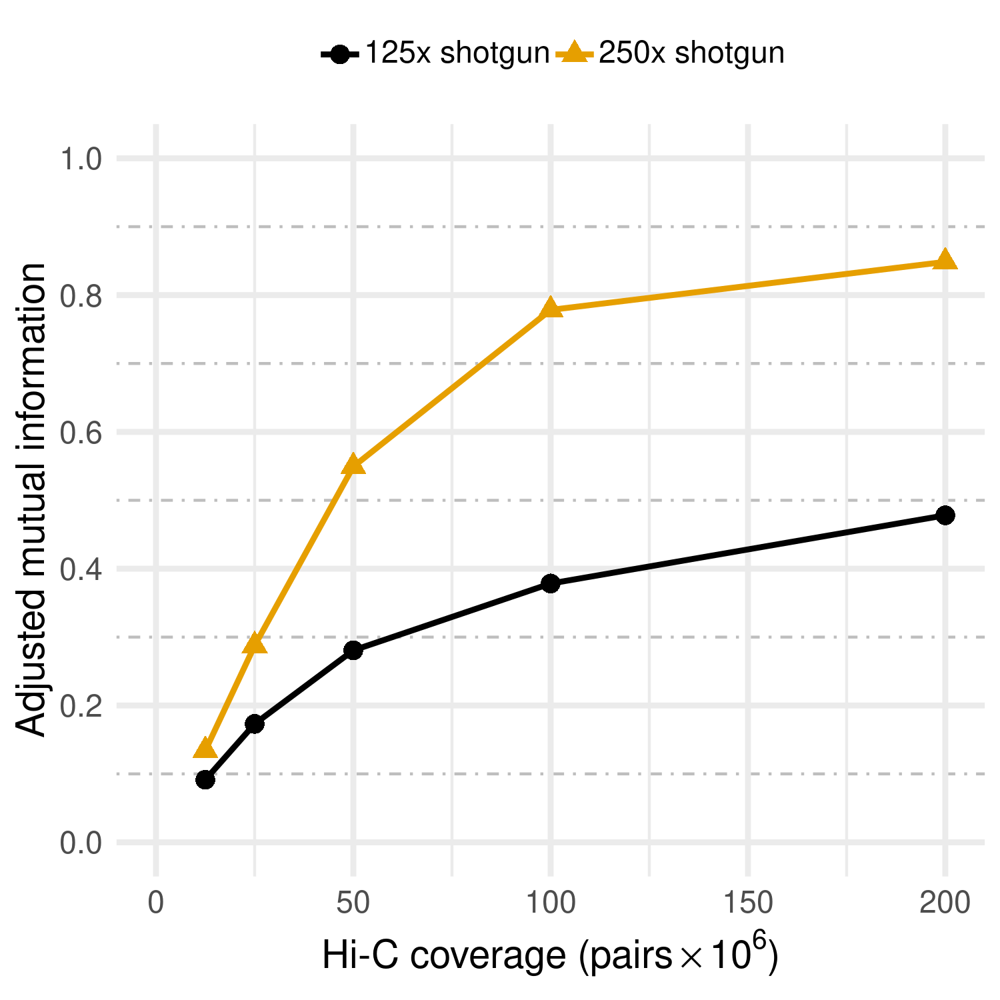

# Metagenomic Hi-C

## What is Metagenomic Hi-C?

As the name suggests, Metagenomic Hi-C is an adaptation of the Hi-C protocol for chromosome 3D structur profiling to shotgun metagenome analysis. Metagenomic Hi-C is a useful addition to the metagenome analysis toolbox because it enables things like genome binning to be carried out accurately and precisely from a single sample rather than a large collection of samples.

The Hi-C protocol was designed to capture genome-wide evidence of DNA molecules in close physical proximity _in vivo_, prior to cellular lysis. With the flexible nature of a chromosome and its capacity to bend back on itself, the most frequently observed interactions are usually those between nearby loci on the same chromosome (intra-chromosomal). After this, the next most frequent interactions are between chromosomes within the same cell (inter-chromosomal). The least common are inter-cellular interactions and are often seen at rates far below those found within a cell.

The original purpose of Hi-C was to study the 3-dimensional conformation of the human genome [1], but this captured proximity information can be readily applied to improve draft genome and metagenome assemblies. In metagenomics we can use the proximity information to infer which assembly fragments (contigs) originated from the same cell (or chromosome). Though the power of the "proximity signal" should provide a level of precision down to individual chromosomes, metagenomic analysis tools currently aim to associate assembly fragments at the genome level into MAGs (as described in the earlier tutorial section on genome binning).

## The Hi-C Library Protocol

!!! info "Major steps of the Hi-C protocol"
    {: style="margin-left: 10%; width:75%"}

### Basic Concept

Though Hi-C read-sets are generated using conventional high-throughput Illumina paired-end sequencing, the more complicated Hi-C protocol produces a very different library. Unlike traditional shotgun sequencing, where read pairs originate from nearby regions on the same contiguous DNA molecule (i.e. chromosome, plasmid, etc), the Hi-C protocol can generate read-pairs from any two strands of DNA that were in close physical proximity within the cell. So long as the two DNA loci interact, regardless of their location with the genome, there is a chance of producing a Hi-C read-pair from that interaction. Hi-C read pairs can therefore originate from far-away regions of the same molecule or from entirely different molecules.

To achieve this, the Hi-C library protocol involves several steps upstream of Illumina adapter ligation and is more challenging to execute in the lab. As a result, commercial kits have been developed which can simplify the process and improve quality and consistency of the resulting libraries.

### Protocol Outline

1. **DNA Fixation:** Beginning with intact cells, the first step of the Hi-C protocol is formalin fixation. The act of cross-linking "locks in" close-by conformation arrangements within the DNA that existed in the cells at the time of fixation.

2. **Cell Lysis:** The cells are lysed and DNA-protein complexes extracted and purified.

3. **Restriction Digest:** The DNA is digested using a restriction endonuclease. In metagenomic Hi-C, enzymes with large overhangs and 4-nt recognition sites are common choices (i.e. Sau3AI, MluCI, DpnII). Differences in the GC bias of the recognition site and the target DNA is an important factor, as inefficient digestion will produce fewer Hi-C read-pairs.

4. **Biotin Tagging:** The overhangs produced during digestion are end-filled with biotinylated nucleotides.

5. **Free-end Ligation:** in dilute conditions or immobilised on a substrate, free-ends protruding from the DNA-protein complexes are ligated. This stochastic process favours any two ends which were nearby within the complex, however random ligation and self-ligation can occur and the reads resulting from such events create noise/error in the data.

6. **Crosslink Reversal:** The bonds created by formalin fixation are removed, allowing the now free DNA to be purified. Proteinase digestion is common following this step.

7. **Un-ligated End Clean-up:** Free-ends which failed to form ligation products are unwanted in subsequent steps but could still be biotin tagged. To minimise their inclusion, a light exonuclease 3' to 5' favoured chew-back can be applied.

8. **DNA Shearing:** With ligation completed, the DNA is mechanically sheared and the size range of the resulting fragment selected suitability with Illumina paired-end sequencing. 

9. **DNA repair:** Sonication can lead to damaged ends and nicks, which can be repaired.

10. **Proximity Ligation Enrichment:** Biotin tagged fragments are pulled down using affinity purification. 

11. **Adapter Ligation:** Illumina paired-end adapter ligation and associated steps to produce a sequencing library are now applied.


## Quality Control: is my library ok?

Due to the highly variable nature of environmental microbe samples, the possible presence of enzyme inhibitors, and other reasons, the metagenomic Hi-C protocol may not always work with high efficiency, or at all. Problems with sample processing can sometimes be identified prior to sequencing, for example if the measured library yield is very low. But other problems may be difficult to diagnose prior to sequencing, for example, it is very difficult to estimate the efficiency of proximity ligation and thus the fraction of sequencing reads that will be Hi-C reads without actually sequencing the sample. The reads that are not Hi-C reads are essentially conventional shotgun read-pairs, which in the context of Hi-C are uninformative. 

The value of the proximity information contained within a Hi-C read-set is high enough that even with a low efficiency library, it can be worthwhile to compensate for low efficiency by sequencing more deeply to obtain more Hi-C read pairs. Thus, determining the percentage of Hi-C read-pairs in the library is important, because it can tell us how deeply we need to sequence our library. Rather than submit a library to a large and costly sequencing run immediately, a small pilot sequencing run can be sufficient to confidently estimate the Hi-C efficiency. Armed with this information, a researcher can make informed decisions about further action; such as whether a candidate Hi-C library should be fully sequenced and to what depth. 

We now discuss various ways to estimate the fraction of Hi-C reads in a library.

#### Evidence of Proximity Ligation

##### Long-range pairs

The separation distance for intra-chromosomal Hi-C read-pairs is bounded only by the length of the chromosome. This is unlike shotgun read-pairs whose separation is rarely more than a thousand nucleotides due to chemistry limitations on Illumina instruments. Though it is less direct than looking for evidence of cut-site duplication events, a simple count of the number of read pairs than map far apart can be used to infer the percentage of Hi-C read-pairs.
The main limitation of this approach is that it requires a high quality reference assembly against which the Hi-C read pairs can be mapped.
In many metagenomic projects, such an assembly is not actually available, either because a good quality shotgun metagenome dataset has not yet been generated for the sample or because there are no close reference genomes in public databases for the organisms in the sample.

!!! success ""
    Counting the number of of pairs which map at long-range can as be used to infer the percentage of Hi-C read-pairs.

##### Proximity ligation junctions

In the Hi-C protocol outlined above, the steps of creating free-ends through enzymatic digestion, subsequent end-repair, and finally re-ligation introduces an artifact at the junction point. This artifact is a short sequence duplication and the exact sequence enzyme dependent. The duplication is produced when the cleavage site overhangs are subjected to end-repair. When the repaired blunt ends are subsequently ligated, their junction contains two copies of the overhang sequence.

!!! info "Proximity junction for the enzyme Sau3AI"
    
    Sau3AI is a 4-cutter with a 4nt overhang.
    
    Native DNA
    ```
    5`-XXXXGATCYYYY-3'
    3'-xxxxCTAGyyyy-5'
    ```
    Free-ends post cleavage have overhangs
    ```
    5`-XXXX     GATCYYYY-3'
    3'-xxxxCTAG     yyyy-5'
    ```
    Blunt ends after end-repair with biotinylated nucleotides
    ```
    5`-XXXXGATC GATCYYYY-3'
    3'-xxxxCTAG CTAGyyyy-5'
    ```
    Free-end ligation produces a duplication at the junction
    ```
    5`-XXXXGATCGATCYYYY-3'
    3'-xxxxCTAGCTAGyyyy-5'
    ```

After the steps of DNA shearing and size selection, fragments which eventually go on to DNA sequencing can contain a junction at any point along their extent. An Illumina paired-end sequencing run, which generates reads at either end of a fragment, thus has two chances to read through the junction.
This approach has two main drawbacks:

* If the fragments in the sequencing library are long relative to the read length, there may be junctions within the fragment that remain unobserved, and this fact must be corrected for in the estimate.
* If the sample was degraded there may have been free ends that were not created by an enzyme cut. These could become proximity-ligated, and therefore ligation junctions may exist that do not contain the obvious junction sequence.

!!! success ""
    Searching the read-set for examples of this junction sequence is one means of measuring the percentage of Hi-C read-pairs in a given library.

## Using a QC Tool

Though the methodology of Hi-C QC has yet to achieve standardisation, a number of tools exist which offer forms of QC testing. These tools can be found as components of Hi-C analysis pipelines (`HiCpipe`), embedded in tool-suites (`HiCExplorer`) and as stand-alone command-line tools (`hic_qc`, `qc3C`) [2-5]. 

In this tutorial we will use `qc3C` to assess Hi-C library quality in two different ways: 

1. Read mapping based analysis
2. _k_-mer based analysis. 

### Get some Hi-C data and tools

For a single timepoint, we'll first download a small Hi-C read-set and its associated shotgun read-set. Also, we'll pull down the Docker images for `qc3C` (quality testing) and `bin3C` (metagenome binning)

!!! example "Get some Hi-C data and the qc3C and bin3C docker images"
    ```Bash
    # download the read-set
    parallel-fastq-dump -s SRR9323809 -s SRR8960211 --threads 4 --outdir hic_data/ --minSpotId 0 --maxSpotId 1000000 --split-files --gzip
    # fetch the qc3C image
    sudo docker pull cerebis/qc3c:alpine
    # fetch the bin3c image
    sudo docker pull cerebis/bin3c:latest
    ```
!!! warning "Make sure you have parallel-fastq-dump"
    If you've skipped the first section on Sequencing run QC, please do this first.
    ```
    conda install -c bioconda parallel-fastq-dump 
    ```
    
### Create a metagenome assembly and map Hi-C reads

The shotgun dataset has been limited to 1M read-pairs, this is only 1/165th of the total. Obviously this reduction in total coverage will lead to a much sparser sampling of the community and a more fragmented assembly. Nevertheless, it is enough data to demonstrate the concept of QC and Hi-C metagenome binning.

Lets assemble the shotgun data and map both library types to the resulting contigs.

!!! example "Create a SPAdes assembly"
    ```Bash
    # enter the hic data directory
    cd hic_data
    # launch spades in metagenomic mode
    sudo docker run -v $PWD:/opt/app-root cerebis/bin3c:latest spades.py --meta -1 SRR8960211_1.fastq.gz -2 SRR8960211_2.fastq.gz -o asm
    # index the contig fasta
    sudo docker run -v $PWD:/opt/app-root cerebis/bin3c:latest bwa index asm/contigs.fasta
    # map hi-c reads to the contigs 
    sudo docker run -v $PWD:/opt/app-root cerebis/bin3c:latest /bin/bash -c "bwa mem -t4 -5SP asm/contigs.fasta SRR9323809_1.fastq.gz SRR9323809_2.fastq.gz | samtools view -uS -F 0x904 - | samtools sort -@4 -n -o hic_to_ctg.bam -"
    # map shotgun reads to the contigs 
    sudo docker run -v $PWD:/opt/app-root cerebis/bin3c:latest /bin/bash -c "bwa mem -t4 -5SP asm/contigs.fasta SRR8960211_1.fastq.gz SRR8960211_2.fastq.gz | samtools view -uS -F 0x904 - | samtools sort -@4 -n -o wgs_to_ctg.bam -"
    # return to your home directory
    cd 
    ```

!!! tip "Breaking down the read mapping command" 
    1. We are providing Docker access to our host filesystem using a bind mount (`-v $PWD:/opt/app-root`)
    2. Next we are specifying the image to run (`cerebis/bin3c:latest`).
    3. Finally we include the actual call, which involves pipes between `bwa` and `samtools`. To achieve this we pass the `bash` shell our complex command, which it then executes within the container. 

### BAM mode analysis with qc3C

We begin with the conceptually simpler approach to Hi-C QC, counting the number of long-range read-pairs from a Hi-C read-set. As a rule of thumb, to work well with Illumina sequencing, the physical size of fragments is likely to be <1000nt. We shall therefore simply count the number of pairs which map with a separation >1000, >5000 and >10,000 nt. 

As the mapped read-pair separation grows beyond 1000nt we expect an increasingly large proportion of these pairs will be due to Hi-C proximity ligation.

Conversely, when analysing a shotgun read-set, we expect to see very few.

!!! example "Run a BAM based analysis"
    ```Bash
    # enter the hic data folder
    cd hic_data
    # perform bam based QC analysis on Hi-C data 
    sudo docker run -v $PWD:/opt/app-root cerebis/qc3c:alpine ash -c "qc3C bam -m 400 -e Sau3AI -e MluCI -b hic_to_ctg.bam"
    # now perform the analysis on shotgun data
    sudo docker run -v $PWD:/opt/app-root cerebis/qc3c:alpine ash -c "qc3C bam -m 400 -e Sau3AI -e MluCI -b wgs_to_ctg.bam"
    # return to your home directory
    cd 
    ```
    
#### Estimation of fragment size

As we are not sure of the mean insert length, we guess it to be 400nt. This is one handy benefit of the BAM mode approach, we can infer a reasonably good estimate of the fragment (insert) length. In _k_-mer mode, having an accurate value becomes important if we wish to estimate the probable fraction of unobserved proximity junctions. That is to say, for long fragments and short reads, much of each fragment goes unsequenced and so we will miss the evidence of junctions.

In our resulting log from above, `qc3C` reports an observed mean fragment length of 445nt for the Hi-C read-set. 

!!! example ""
    ```
    INFO     | 2019-06-23 18:55:18,652 | qc3C.bam_based | Observed mean of short-range pair separation: 445nt
    ```

#### Looking at the results

The last three lines of the output from `qc3C` report the absolute number and relative fraction of read-pairs that mapped far apart. 
 
For the Hi-C library, the fraction of pairs separated by more than 10kb was ~2.7%, while in contrast for the known shotgun library the fraction was <0.006%. 

!!! example ""
    Hi-C result
    ```
    INFO     | 2019-06-23 18:55:18,654 | qc3C.bam_based | Long-range distance intervals:    1000nt,    5000nt,   10000nt
    INFO     | 2019-06-23 18:55:18,654 | qc3C.bam_based | Number of observed pairs:           94,        46,        23
    INFO     | 2019-06-23 18:55:18,654 | qc3C.bam_based | Relative fraction of all obs:   0.1116,   0.05463,   0.02732

    ```
    Shotgun result
    ```
    INFO     | 2019-06-23 18:56:13,330 | qc3C.bam_based | Long-range distance intervals:    1000nt,    5000nt,   10000nt
    INFO     | 2019-06-23 18:56:13,331 | qc3C.bam_based | Number of observed pairs:          284,        43,        23
    INFO     | 2019-06-23 18:56:13,331 | qc3C.bam_based | Relative fraction of all obs:   0.0007268,   0.0001101,   5.886e-05
    ```

It is important to keep in mind that as the assembly was made from a shotgun dataset downsampled to very low coverage, the length of contigs is significantly lower than would have been obtained with the full dataset. This will impair the odds of seeing pairs which map far away. Despite this, the 97% of pairs in the shotgun library map to the same contig sequence. In contrast, 72% of Hi-C pairs mapped to the same contig.

Overall, for BAM mode, the reliability of results is connected to the quality and completeness of the available references. 

!!! tip "Breaking down the invocation of `qc3C`" 
    1. We are providing Docker access to our host filesystem using a bind mount (`-v $PWD:/opt/app-root`)
    2. Next we are specifying the image to run (`cerebis/qc3c:alpine`).
    3. Finally we include the actual call to `qc3C`, along with its own options. 

!!! info "Potential Concerns"

    - Requires a reference sequence:
        - a completed genome
        - a draft assembly.
    - May not be an option when:
        - no reference is available
        - only a very highly fragmented draft exists 
    - Computational requirements:
        - create the shotgun assembly
        - map Hi-C reads to the reference 
    - The distribution of assembly contig lengths will affect the maximum mapping distance.

### _k_-mer mode analysis with qc3C

To analyze our small Hi-C read-set using a _k_-mer approach, we will first create a _k_-mer library using Jellyfish. Since this Hi-C experiment used the 4-cutter Sau3AI, which produces an 8-mer junction, we'll use a mer size of 24 for the library. This will give us 8 nucleotides either side of any prospective junction, for specificity. 

Choosing how large a _k_-mer size to use for the library is a trade-off between computational complexity and minimising false discovery. You can try sizes bigger and smaller.

!!! example "Running k-mer based analyses"
    On the Hi-C data
    ```Bash
    # enter the hic data folder
    cd hic_data
    # create a generator used by Jellyfish for compressed files
    rm -f gen_fq && for fn in `ls SRR9323809*fastq.gz`; do echo gzip -dc $fn >> gen_fq; done
    # use jellyfish to create a 24-mer library from FastQ reads
    sudo docker run -v $PWD:/opt/app-root cerebis/qc3c:alpine jellyfish count -t 4 -m 24 -s 100M -C -g gen_fq -o hic24.jf
    # perform k-mer based QC analysis
    sudo docker run -v $PWD:/opt/app-root cerebis/qc3c:alpine ash -c "qc3C kmer -m 445 -s 1234 -e Sau3AI -l hic24.jf -r SRR9323809_1.fastq.gz -r SRR9323809_2.fastq.gz"
    # return back to your home directory
    cd 
    ```
    Now on the shotgun data
    ```Bash
    # enter the hic data folder
    cd hic_data
    # create a generator used by Jellyfish for compressed files
    echo "gzip -dc SRR8960211_1.fastq.gz" > gen_sg
    # use jellyfish to create a 24-mer library from FastQ reads
    sudo docker run -v $PWD:/opt/app-root cerebis/qc3c:alpine jellyfish count -t 4 -m 24 -s 100M -C -g gen_sg -o wgs24.jf
    # perform k-mer based QC analysis
    sudo docker run -v $PWD:/opt/app-root cerebis/qc3c:alpine ash -c "qc3C kmer -m 306 -s 1234 -e Sau3AI -l wgs24.jf -r SRR8960211_1.fastq.gz -p 0.05"
    # return back to your home directory
    cd 
    ```

#### Looking at the results

Looking at the inferred fraction of true Hi-C read-pairs, we can immediately see that the low coverage shotgun assembly appears to have drastically skewed the estimate of signal (2.7% vs 6.9 +/- 2.4%). After adjustment for the unobserved fraction (0.32), the signal estimate increases to 9.1 +/- 3.1%.

In comparison, for the shotgun data the inferred fraction of Hi-C read-pairs is 0.22 +/- 9.4%, with an unobserved fraction of just 0.013. This value of this estimate is dubious at best. If we look further up the log we can see that the number of observed junctions was 0.098%, while by random chance this would be 0.0015%. Although this appears greater than by chance and possibly significant, this is put clear in perspective when compared to the Hi-C result of 5.9%.

Therefore, the Hi-C library appears to have a reasonable fraction of Hi-C reads. As a pilot study, we should probably send this to be more deeply sequenced.

!!! example ""
    Hi-C result
    ```
    INFO     | 2019-06-23 19:45:13,826 | qc3C.kmer_based | For supplied insert length of 445nt, estimated unobserved fraction: 0.3213
    INFO     | 2019-06-23 19:45:13,826 | qc3C.kmer_based | Adjusted estimation of Hi-C read fraction: 9.135 ± 3.148 %
    INFO     | 2019-06-23 19:30:03,640 | qc3C.kmer_based | Estimated Hi-C read fraction via p-value sum method: 7.211 ± 2.756 %
    ```
    Shotgun result
    ```
    INFO     | 2019-06-23 19:47:10,690 | qc3C.kmer_based | Estimated Hi-C read fraction via p-value sum method: 0.2242 ± 9.365 %
    INFO     | 2019-06-23 19:47:10,690 | qc3C.kmer_based | For supplied insert length of 306nt, estimated unobserved fraction: 0.01307
    INFO     | 2019-06-23 19:47:10,690 | qc3C.kmer_based | Adjusted estimation of Hi-C read fraction: 0.2272 ± 9.487 %
    ```

!!! tip "Breaking down the invocation of `jellyfish`" 
    1. We are providing Docker access to our host filesystem using a bind mount (`-v $PWD:/opt/app-root`)
    2. Next we are specifying the image to run (`cerebis/qc3c:alpine`).
    3. Finally we include the actual call to `jellyfish`, along with its own options. 

!!! info "K-mer mode requirements"
    - No-assembly or reference required
    - Requires making a k-mer library from FastQ reads
    - Analyse FastQ reads against library

## Metagenome Binning with Hi-C Data

As we saw by processing timeseries data with `MetaBAT2`, metagenome binning can also be performed using Hi-C. The primary difference here is that accurate and precise binning is possible from a single timepoint, so long as you have you have both a shotgun and Hi-C read-set. Currenty, only a few tools exist which were made specifically for this purpose (`bin3C`, `ProxiMeta`) [6,7]. 

In this tutorial we will use bin3C, as it is open-source and easy to use. 

With a set of reference sequences and Hi-C to reference BAM file in hand (from above), a `bin3C` analysis has two stages: first create the contact map, second cluster the contact map. We also need to know what enzyme(s) was used in generating the library. It is becoming more common to generate libraries from two enzymes with differing GC biases to improve Hi-C coverage within a community. In such cases, we simply specify them when creating the map, as here.

!!! example "Perform Hi-C metagenome binning"
    ```Bash
    # enter hic data directory
    cd hic_data
    # Make contact map
    sudo docker run -v $PWD:/opt/app-root cerebis/bin3c:latest bin3C -v mkmap -e Sau3AI -e MluCI --eta --bin-size 5000 asm/contigs.fasta hic_to_ctg.bam bin3C_out
    # Cluster contact map
    sudo docker run -v $PWD:/opt/app-root cerebis/bin3c:latest bin3C -v cluster --clobber --only-large bin3C_out/contact_map.p.gz bin3C_out 
    # return to your home directory
    cd
    ```
    
#### Looking at the results

After `bin3C` completes the clustering step, the three outputs which are possibly the most interesting are:
 
1. The comma delimited `cluster_report.csv` table
    - the cluster_report details characteristics of each identified cluster.
    - An id, name, number of contigs, total extent, mean GC and coverage, etc.
    - Mean coverage is a reasonable gauge of relative abundance
 2. A qualitative overview of the result in the form of a heatmap `cluster_plot.png`
    - contigs are organized by cluster, followed by descending length
    - a pixel represents a 5kb bin and therefore contigs are represented proportional to their length.
 3. Clustered sequence data
    - the `fasta/` directory contains cluster FastA data

 The cluster plot is a visual representation of the clustered contact map. As a metagenomic assembly can easily contain 50k to 100k contigs, which as a NxN image would be very large, the plot's resolution is constrained by default to 4000x4000 pixels to conserve memory.
 
 Once organised, a good Hi-C read-set will have produced a map that is clearly in block-diagonal form with high contrast. Also, a significant proportion of the map's field is should be dark, reflecting the fact that inter-cellular interactions are rare. In cases where there was insufficient signal, there will only be a few (if any) large clusters and they will look sparse internally.

!!! info "Example cluster plot of a human microbome"
    {: style="margin-left: 12%; width:75%"}
    
    MAG clusters of a single-timepoint human faecal microbiome (PRJNA413092) as determined by `bin3C`. The shotgun read-set consisted of 249M pairs, while the Hi-C library contained 41M pairs (~10% Hi-C). Of the identified MAGs, 55 where >90% complete, <5% contamination as estimated by CheckM [6]. 
 
 
 If you are familiar with the appearance of a single-genome microbial contact map, at sufficient zoom you may notice that the individual clusters do not look the same. This is due to the fact that the proper ordering of contigs (scaffolding) within the clusters has not been established.
 
After reaching this point, standard downstream analyses would be to profile the taxonomic composition of the clusters with tools such as [`CheckM`](https://github.com/Ecogenomics/CheckM).

!!! info "Expectations from Hi-C binning"
    {: style="margin-left: 25%; width:50%"}
    
    Hi-C metagenome binning is dependent on both the quality of the shotgun assembly and the depth of true Hi-C read-pairs. For a Hi-C data-set with strong signal (perhaps 10%) and reasonable depth of sequencing (100M pairs), it is reasonable to expect 50-100 nearly complete MAGs [6].
 
## References

1. Lieberman-Aiden, E., van Berkum, N. L., Williams, L., Imakaev, M., Ragoczy, T., Telling, A., … Dekker, J. (2009). Comprehensive mapping of long-range interactions reveals folding principles of the human genome. _Science_, 326(5950), 289–293. https://doi.org/10.1126/science.1181369

2. fchen. (n.d.). HiCpipe. Retrieved from https://github.com/ChenFengling/HiCpipe

3. Wolff, J., Bhardwaj, V., Nothjunge, S., Richard, G., Renschler, G., Gilsbach, R., … Grüning, B. A. (2018). Galaxy HiCExplorer: a web server for reproducible Hi-C data analysis, quality control and visualization. _Nucleic Acids Research_, 46(W1), W11–W16. https://doi.org/10.1093/nar/gky504

4. DeMaere, M. Z., Darling A. E. (n.d.). qc3C. Retrieved from https://github.com/cerebis/qc3C

5. hic_qc. (n.d.). Retrieved from https://github.com/phasegenomics/hic_qc

6. DeMaere, M. Z., & Darling, A. E. (2019). bin3C: exploiting Hi-C sequencing data to accurately resolve metagenome-assembled genomes. _Genome Biology_, 20(1), 46. https://doi.org/10.1186/s13059-019-1643-1

7. Press, M. O., Wiser, A. H., Kronenberg, Z. N., Langford, K. W., Shakya, M., Lo, C.-C., … Liachko, I. (2017). Hi-C deconvolution of a human gut microbiome yields high-quality draft genomes and reveals plasmid-genome interactions (p. 198713). https://doi.org/10.1101/198713
