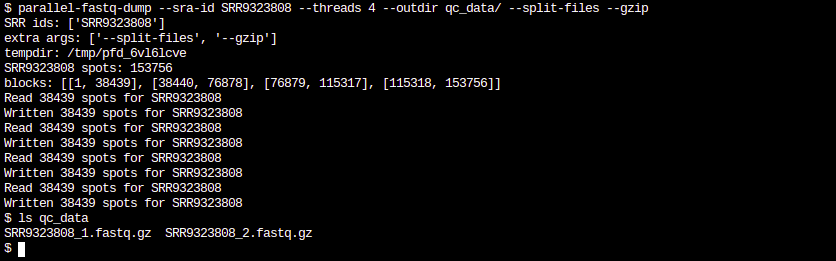
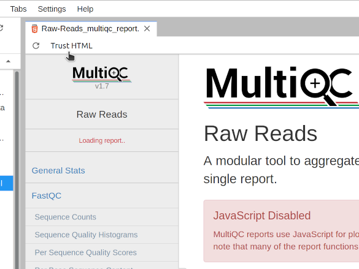

# Sequencing run QC

## Get some sequence data

The first thing we'll do is to get some sequence data to work with. If you are working on a new sequencing project the data might instead come directly from a sequencing facility. For this tutorial we'll work with data that is available in public databases.

Published sequence data is usually archived in the NCBI SRA, the ENA, and the DDBJ.
Each of these databases provide [convenient search interfaces](https://www.ncbi.nlm.nih.gov/), which can be used to find samples by keyword and sample type (e.g. shotgun metagenome).
The data-sets we'll use in the following exercises (SRA accessions SRR9323808, SRR9323810, SRR9323811, SRR9323809) are small in size and therefore quick to process.

With an accession number in hand, the easiest way to obtain the related sequencing data from the databases is via the `fastq-dump` software.

First, let's create a new conda environment, install Python along with the SRA Toolkit and the activate it.
To do this, start a terminal session in your Jupyter server (click the Terminal icon) and run the following command (its ok to copy and paste):

!!! example "Setup an initial set of tools"
    ```bash
    # fast download from github
    git clone https://github.com/rvalieris/parallel-fastq-dump.git
    # create a new conda environment and activate it
    conda create -y -n workshop "python<3" sra-tools
    conda activate workshop
    ```
    
!!! info
    We've just created a new conda environment and activated it. You will see your prompt now tells you this fact with `(workshop)`.    
    
Now that you've installed fastq-dump we can use it to download data by accession number. Copy and paste the following to your terminal:

!!! example "Download the sequencing data for our data-sets"
    ```bash
    parallel-fastq-dump/parallel-fastq-dump -s SRR9323808 -s SRR9323810 -s SRR9323811 -s SRR9323809 \
        --threads 4 --split-files --gzip --outdir qc_data/
    ```

If the download was successful, a new subfolder `qc_data` should exist and within that you should find the fastq files. Using your terminal session, try listing the contents of the subfolder (`ls qc_data`). You should see something like the following:

!!! info "You can check that the fastq files exist"
    {: style="margin-left: 5%; width:90%"}


## Evaluating sequence quality with FastQC and MultiQC

The very first thing one would normally do when working with a new dataset is to look at some basic quality statistics on the data.
There are many, many tools available to compute quality metrics. For our current data we will use the FastQC software, applied to each sample, and then combine the results using MultiQC to a single report. First step is to install `fastqc` and `multiqc`.

!!! example "Install `fastqc` and `multiqc` for QC analysis"
    ```bash
    conda install -y -n workshop fastqc multiqc
    ```
    
In the above we've used conda to install fastqc, but we've used another way to install multiqc -- something called `pip`. pip is an installer for python programs, and like conda it will download and install the software along with any dependencies. The reason we use pip in this case is because conda can be very, very slow to install some programs and in this case pip is much faster.

!!! example "Use fastqc to analyse the datasets"
    ```bash
    cd qc_data
    ls *.fastq.gz | xargs fastqc
    ```

!!! info "Unpacking the commands"
    1. First we change the current directory (`cd qc_data`).
        - any subsequent command will, by default, now run in qc_data.
    2. Next we get the list of fastq files (`ls *.fastq.gz`) and pass that to `xargs`. 
        - the wildcard expression (`*.fastq.gz`) matches all of the sequencing data files.
        - this list of files is then piped (`|`) to the next command `xargs`.
        - the `xargs` command allows you to build and execute command lines. In this simplest form, `xargs` merely takes the list of files it receives and makes them arguments to `fastqc`.
        - `fastqc` is then run, where each of the fastq files will included as an argument. 

If this step has worked, then you should have several new `.zip` files containing the QC data in that directory, along with some html files. When we have a lot of samples it is too tedious to look at all the QC reports individually for each sample, so we can summarize them using multiqc.

!!! example "Create a summary report"
    ```bash
    multiqc --title "Raw Reads" .
    ```

At this point a multiqc report file will appear inside the QC directory. First double click to open the QC folder.

!!! info "Opening our working directory in Jupyter"
    {: style="margin-left: 25%; width:50%"}

Once we've navigated to the QC directory, a file called `Raw-Reads_multiqc_report.html` will appear in the listing. To open this report, simply double-click on the file name and a new tab will appear in Jupyter. 

!!! info "Opening the HTML report in Jupyter"
    {: style="margin-left: 25%; width:50%"}

Switching to the report tab, first click "Trust HTML" button in the top left-hand corner. Doing this will permit JavaScript to execute within the page, which is used for drawing the figures.

!!! info "Opening the HTML report in Jupyter"
    {: style="margin-left: 25%; width:50%"}

From here we can evaluate the quality of the libraries.

## Cleaning up reads with fastp

Now that we have evaluated the condition of our raw data-sets, we are in a better position to judge whether everything looks ok. Though we may feel that our data is in an acceptable state for further analysis, sometimes smaller details can escape us. Therefore, subjecting data-sets to a experimentally suitable clean-up procedure is good practice. What is suitable for a given experiment depends on what will ultimately be inferred. In the case of assembly, contaminating sequence or an abundance of low-quality base-calls will likely lead to worse results. Therefore, identifying and removing this type of error will be advantageous. In constrast, clean-up procedures the attempt to correct base-calling errors can be inappropriate when a sample is not clonal (ie. metagenomics). Here, the assumption that SNV are errors, leads to software removing the micro-diversity within the sample.

While sequencing technology continues to evolve and refine, data-sets generated from even the latest NGS platforms will not be error-free. There exist both random and systematic sources of error in sequencing data and a wide assortment of tools are available to identify and eliminate them. It is important to note that not every clean-up procedure is appropriate for all types of experiment and care should be taken not to falsely remove true observations from your data.

For our shotgun sequencing data, we will use `fastp`, which runs quickly and is easy to use.

!!! example "Install fastp for cleaning up reads"
    ```bash
    conda install -y -n workshop fastp
    ```

By default, `fastp` will apply the following clean-ups:

1. automatically identify and remove lingering adapter sequence.
2. trim off low quality bases on the tail-end.
3. filter out very short reads and reads with too many Ns.

Lingering adapter sequence can be thought of an experimental contamination and represents a misleading source of systematic error, while low quality base calls are more-so a source of random error.

!!! example "Run `fastp` on our data-sets"
    ```bash
    mkdir cleaned
    for r1 in $(ls *_1.fastq.gz)
    do
        # extract the SRR from the filename
        srr=$(basename $r1 _1.fastq.gz)
        # run fastp on paired reads
        fastp --in1 ${srr}_1.fastq.gz --in2 ${srr}_2.fastq.gz \
              --out1 cleaned/${srr}_1.fastq.gz --out2 cleaned/${srr}_2.fastq.gz
    done
    ```
!!! info "Unpacking the commands"
    1. create a new subfolder for holding the cleaned data-sets (`mkdir cleaned`)
    2. using a for-loop in Bash, individually submit R1/R2 pairs to fastp
        - the loop iterates over the list of just R1 files, obtained using the wildcard `*_1.fastq.gz`
        - for each R1 file, extract the base SRR id (`srr=$(basename $r1 _1.fastq.gz)`)
        - call fastp for paired R1/R2 files, constructing from the srr:
            - the input files (`${srr}_1.fastq.gz`, `${srr}_2.fastq.gz`)
            - the output files (`cleaned/${srr}_1.fastq.gz`, `cleaned/${srr}_2.fastq.gz`)
    
Although `fastp` produces its own reports, we will again use `fastqc` and `multiqc` so that we can compare our cleaned and raw data-sets. 

!!! example "Perform QC analysis on the cleaned data-sets"
    ```bash
    ls cleaned/*.fastq.gz | xargs fastqc
    multiqc --title "Cleaned Reads" cleaned
    ```

The resulting `multiqc` report will be entitled `Cleaned-Reads_multiqc_report.html`. Double click this file in Jupyter to open the tab and select "Trust HTML" to enable the JavaScript figures as described above for the raw data-sets.

As none of our data-sets suffers from serious problems, when we compare the Raw and Cleaned reports, there are not many obvious changes. One difference that is easily noticeable is found in the section "*Adapter Content*". Although only a small proportion of reads were affected by lingering adapter sequence in the raw data-sets, `fastp` has removed what remained. Without too much effort, we have eliminated a source of systematic error -- tools downstream will no longer be tasked with reconciling an artifact of data collection with real observations.

## Taxonomic analysis

Metagenome taxonomic analysis offers a means to estimate a microbial community profile from metagenomic sequence data.
It can give us a very high-level, rough idea of what kinds of microbes are present in a sample.
It can also give an idea of how complex/diverse the microbial community is -- whether there are many species or few.
It is useful as an initial quality check to ensure that the microbial community composition looks roughly as expected, and to confirm that nothing obvious went wrong during the sample collection and sequencing steps.

### Taxonomic analysis with Metaphlan2

While it may be possible to install metaphlan2 via conda, at least in my experience, conda struggles with "solving the environment".
Therefore it's suggested to install it via the simple download method described on the [metaphlan tutorial page](https://bitbucket.org/nsegata/metaphlan/wiki/MetaPhlAn_Pipelines_Tutorial):

!!! warning "Skip downloading metaphlan2"
    The >500MB Metaphlan2 package has already been downloaded and we'll just be extracting it.

!!! example "Obtaining `metaphlan`"
    ```bash
    # this would be how you could download the package yourself
    # wget -c -O metaphlan.tar.bz2 https://bitbucket.org/nsegata/metaphlan/get/default.tar.bz2
    
    # extract the archive
    cd ; tar xvjf /data/metaphlan.tar.bz2
    # rename the folder to something simple
    mv nsegata-metaphlan* metaphlan
    # apply a technical fix for metaphlan plotting
    sed -i 's/axisbg/facecolor/' metaphlan/plotting_scripts/metaphlan_hclust_heatmap.py
    # install dependencies
    conda install -y -n workshop bowtie2 numpy scipy matplotlib
    ```

Once `metaphlan` has been prepared we can run it on our QC samples:

!!! example "Running `metaphlan` on our data"
    ```bash
    cd ~/qc_data
    for pig in SRR9323808 SRR9323810 SRR9323811 SRR9323809
    do
         zcat ${pig}*.fastq.gz | ~/metaphlan/metaphlan.py --input_type multifastq --bt2_ps very-sensitive \
                --bowtie2db ~/metaphlan/bowtie2db/mpa --bowtie2out ${pig}.bt2out -o ${pig}.mph2
    done
    ```

!!! info "Unpacking the commands"
    The above series of commands is another exampe of a Bash "for loop", where each iteration processes one of our metagenome samples. As before, this is a convenient and less error-prone way to process many samples by avoiding the need to type out the commands for each sample. At each loop iteration, one of the sample names is placed into the loop variable `${pig}`, where it can get used in the command inside the loop.
    
    Secondly, we decompress (`zcat`) and then feed each pig's sequencing data to `metaphlan` through a pipe (`|`)

Finally we can plot the taxonomic profile of the samples:

!!! example "Plot the taxonomic profile of each sample"
    ```
    ~/metaphlan/utils/merge_metaphlan_tables.py *.mph2 > pig_mph2.merged
    ~/metaphlan/plotting_scripts/metaphlan_hclust_heatmap.py -c bbcry --top 25 --minv 0.1 -s log --in pig_mph2.merged --out mph2_heatmap.png
    ```

Once that has completed successfully, a new file called `mph2_heatmap.png` will appear in the qc_data folder of our Jupyter file browser. We can double click it to view.

There are other ways to visualize the data, and they are described in the graphlan section of the [metaphlan tutorial](https://bitbucket.org/nsegata/metaphlan/wiki/MetaPhlAn_Pipelines_Tutorial) page.

### Taxonomic analysis with other tools

There are a whole range of other software tools available for metagenome taxonomic analysis. 
They all have strengths and weaknesses.

A few other commonly used tools are listed here:

* [kraken2](https://ccb.jhu.edu/software/kraken2/index.shtml)
* [MEGAN](http://ab.inf.uni-tuebingen.de/software/megan6/)
* [Centrifuge](http://www.ccb.jhu.edu/software/centrifuge/manual.shtml)
* [CLARK](http://clark.cs.ucr.edu/)


## Evaluating the host genomic content

In many applications of metagenomics we are working with host-associated samples. 
The samples might have come from an animal gut, mouth, or other surface.
Similarly for plants we might be working with leaf or root surfaces or rhizobia.
When such samples are collected the resulting DNA extracts can include a significant fraction of host material.
Let's have a look at what this looks like in data.
To do so, we'll download another set of pig gut samples: a set of samples that was taken using scrapings or swabs from different parts of the porcine digestive system, including the duodenum, jejunum, ileum, colon, and caecum.
Rather than using `metaphlan2` to profile these, we will use the `kraken2` classifier in conjunction with the bracken tool for estimating relative abundances.
We first need to install `kraken2` and `bracken`:

!!! example "Install `kraken2` and `braken`"
    ```bash
    conda install -y -n workshop kraken2 bracken
    ```

Next, we need a `kraken2` database.

For this tutorial we will simply use a precomputed `kraken2` database, note however, the very important limitation that the only non-microbial genome it includes is the human genome.
If you would like to evaluate host genomic content on plants or other things, you should follow the instructions on the `kraken2` web site to build a complete database.

!!! warning "Skip downloading the database"
    The Kraken team maintain this and a number of other prepared databases which they make available for download. However, as a matter of courtesy, we will avoid repeatedly requesting the same data.

The archive has already been downloaded and we will just be extracting the contents as follows:

!!! example "Extract the precomputed `kraken2` reference database"
    ```bash
    cd ; tar xvzf /data/minikraken2_v2_8GB_201904_UPDATE.tgz
    ```

Finally we are ready to profile our samples with `kraken2` and `bracken`.

We'll first download the sample set with `parallel-fastq-dump` and then run `kraken2` and `bracken`'s `est_abundance.py` script on each sample using a bash for loop.
The analysis can be run as follows:

!!! example "Download some new samples"
    ```bash
    # the list of samples
    samples="SRR9332442 SRR9332438 SRR9332439 SRR9332443 SRR9332440"
    # download the associated data
    parallel-fastq-dump/parallel-fastq-dump ${samples//SRR/-s SRR} --threads 4 --split-files \
            --gzip --outdir host_qc/
    # switch to the data directory and analyse
    cd host_qc
    for s in $samples
    do
        # run kraken2 analysis
        kraken2 --paired ${s}_1.fastq.gz ${s}_2.fastq.gz --db ~/minikraken2_v2_8GB_201904_UPDATE/ \
            --report ${s}.kreport > ${s}.kraken
        # estimate abundance with braken
        est_abundance.py -i ${s}.kreport -o ${s}.bracken \
            -k ~/minikraken2_v2_8GB_201904_UPDATE/database150mers.kmer_distrib
    done
    ```

Once the above has completed, navigate over to the `host_qc` folder in the Jupyter file browser and click on the `*.bracken` files to open them.

#### What do you see?
In particular, why does sample SRR9332438 look so different to sample SRR9332440?

Keep in mind the isolation sources of the samples were as follows:

| Sample     | Source   |
|------------|----------|
| SRR9332442 | Duodenum |
| SRR9332440 | Caecum   |
| SRR9332439 | Ileum    |
| SRR9332438 | Jejunum  |
| SRR9332443 | Colon    |

#### Some challenge questions
* If we sequenced samples from pigs, why is human DNA being predicted in these samples?
* If we were to design a large study around these samples which of them would be suitable for metagenomics, and why?
* How much sequencing data would we need to generate from sample SRR9332440 to reconstruct the genome of the _Bifidobacterium_ in that sample? What about the _E. coli_?
* Are there really six species of _Lactobacillus_ present in SRR9332440?
* Go to the [NCBI SRA search tool](https://trace.ncbi.nlm.nih.gov/Traces/sra/sra.cgi?view=search_obj) and find a metagenome of interest to you. Download the first 100000 reads from it (use the `--maxSpotId` parameter) and analyse it with kraken2. Is it what you expected? How does it compare to the others we've looked at?

## A note on negative controls

Negative controls are a key element in any microbiome profiling or metagenome analysis work.
Every aspect of the sample collection and processing can be impacted by the presence of contaminating microbial DNA.
This is true even of 'sterile' material -- just because no viable cells exist in a sample collection swab, for example, does not mean there is no microbial DNA on that swab.
It is well known that molecular biology reagents frequently contain contaminating DNA.
Usually it is at low levels, but this is not always the case.

Therefore, the best practice is to collect multiple negative control samples that are taken all the way through sequencing.
These negative controls can then be used to correct for contamination artifacts in the remaining samples.

